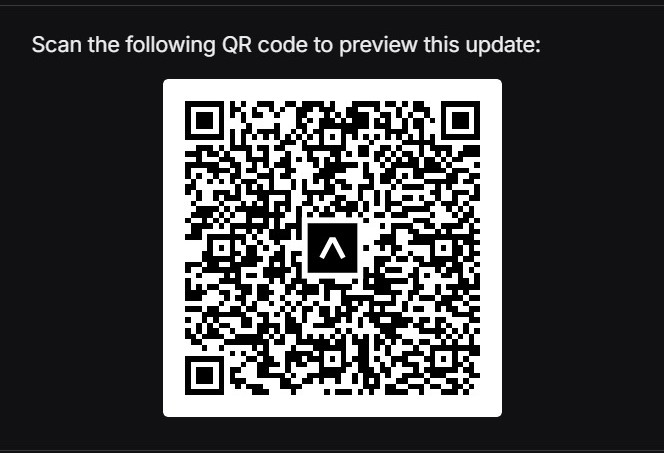

# **JomNiaga**

#### *"Simplifying business for all in one platform, one journey, and endless growth."* 🚀

---

## 📝 Overview

**JomNiaga** is a digital business onboarding platform designed to simplify the journey for Malaysian MSMEs to enter the digital economy. The app provides an **all-in-one solution** for new and informal businesses to easily:

- Register and formalize their business  
- Manage compliance and licensing  
- Integrate with digital payment systems  
- Access financial services such as loans, grants, and government programs  

By streamlining onboarding into a **single, reusable flow**, JomNiaga reduces paperwork, minimizes dropout rates, and unlocks continuous access to financial tools. The platform nudges MSMEs toward better financial practices while supporting **sustainability** and **inclusivity** as part of Malaysia's evolving digital payment ecosystem.

---

## Get Started with JomNiaga  
This guide will walk you through setting up the JomNiaga app on your machine using Expo Go.  
1. Download Expo Go app from App store or Google Playstore.
2. Scan the QR below using your device's camera
 
---

## 🚧 Challenges

1. **Complex MSME Onboarding**  
   MSMEs face fragmented and repetitive registration processes across multiple platforms, slowing down digital adoption.

2. **Limited Access to Financial Services**  
   Small businesses struggle to qualify for loans, grants, and support programs due to lack of formalization and real-time eligibility checks.

3. **High Dropout Rates During Formalization**  
   Cumbersome forms and unclear steps lead to up to **50% of MSMEs** abandoning digital onboarding before completion.

---

## ✨ Key Features

- **One-Stop Business Onboarding** 🗂️  
   Simplifies MSME registration, licensing, and compliance into a single, guided flow.

- **Digital Payment Integration** 💳  
   Connects MSMEs to QR payments, e-invoicing, and settlements—no technical expertise needed.

- **Financial Access Enablement** 💰  
   Unlocks access to loans, grants, and government programs via digital identity verification.

- **Real-Time Notifications** 🔔  
   Alerts MSMEs about license renewals, compliance deadlines, and funding opportunities.

- **Simplified User Experience** 🧭  
   Tailored for MSMEs of all sizes and digital literacy levels, reducing dropout rates.

- **Continuous Support & Growth** 📈  
   Provides ongoing services like credit scoring, analytics, and business insights.

---

## 🏗️ Solution Architecture

  

---

## 🛠️ Technology Stack

This document outlines the architecture and technologies used in the MSME onboarding and loan application platform.

### **Architecture Overview**

The solution is composed of four main layers:

---

### **1️⃣ Front-end**

**Technology:**  
- **React Native**

**Purpose:**  
- Provide a mobile-first user interface for MSMEs
- Simplify registration, document submission, and loan applications
- Interact with backend services through API calls

---

### **2️⃣ Back-end**

**Technology:**  
- **FastAPI (Python)** and **Node.js**

**Features:**

#### Loan Stress Test Module
- **Python Script**
    - Calculate **Debt Service Ratio (DSR)**
    - Compute **Business Volatility**
    - Categorize **Risk Level**: Safe, Moderate, High Risk

#### Auto Fill-in Registration
- **OCR & Computer Vision**
    - Use **Snap IC** feature to capture identity card images
    - Extract text data (IC number, Name, Address)
    - Auto-fill registration forms using extracted data
    - Convert extracted data into **JSON format**

#### Loan Application Handling
- Manage application submission
- Connect to financial analysis and risk evaluation
- Prepare data for database storage and API exchange

---

### **3️⃣ Database**

**Technology:**  
- **Firebase Cloud Storage**
    - Store scanned documents and IC images

- **Firebase Realtime Database**
    - Store user profiles, financial data, and application records

---

### **4️⃣ OpenAPI Integrations**

**Purpose:**  
Enable real-time integration with financial services and government platforms.

#### Malaysia Bank & E-Wallet APIs
- Maybank, CIMB, RHB, Public Bank, HSBC, OCBC, AmBank, Alliance Bank, UOB
- E-wallets: Touch 'n Go, GrabPay, ShopeePay

#### Legal Authorities APIs
- **SSM (Suruhanjaya Syarikat Malaysia)** – Company Registration
- **LHDN (Lembaga Hasil Dalam Negeri)** – Tax Compliance & E-Invoice
- **MyGOV & Government Portals** – Licensing & Subsidy Programs

---

# 🚀 Loan Eligibility Risk Classifier

This project is an *end-to-end machine learning pipeline* to classify *business loan applications* into risk categories:

- ✅ *Safe*
- ⚠️ *Moderate*
- ❌ *High Risk*

The model is deployed via **FastAPI** and hosted on **Render.com**.

---

## 🌐 Live API

**Base URL:**  
https://loan-eligibility-ml.onrender.com/

**API Documentation (Swagger UI):**  
https://loan-eligibility-ml.onrender.com/docs

---

# 📊 Features & Financial Calculations

The model uses *24 months of financial transaction data* per business to compute the following metrics:

### 💵 Average Monthly Sales

### 💸 Average Monthly Expenses

### 📈 Volatility of Sales

*Measures the business stability:*

### 🔄 Net Operating Cash Flow (NOCF)

### 🧮 Debt Service Ratio (DSR)

*Measures the ability to service debt:*

---

# 🧠 Risk Classification Logic

| Condition | Risk Category |
|------------|---------------|
| DSR > 1.8 and Volatility < 0.15 | ✅ *Safe* |
| DSR < 0.8 or Volatility > 0.5 | ❌ *High Risk* |
| Else | ⚠️ *Moderate* |

---

## 📄 Project Info

**Project Title:** JomNiaga  
**Team Name:** Paytriots  
**Team Members:** Izzul, Zaid, Afifah, Adli, Fahmi  
**Institution:** Universiti Tenaga Nasional (UNITEN)  
**Event:** PayHack 2025
