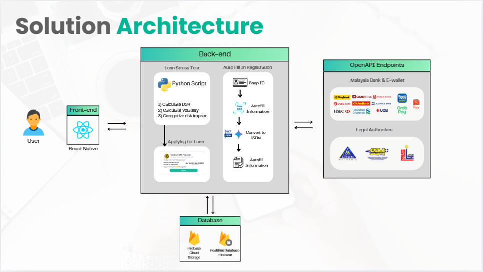

# **JomNiaga**

#### *"Simplifying business for all in one platform, one journey, and endless growth."* 🚀

---

## 📝 Overview

**JomNiaga** is a digital business onboarding platform designed to simplify the journey for Malaysian MSMEs to enter the digital economy. The app provides an **all-in-one solution** for new and informal businesses to easily:

- Register and formalize their business  
- Manage compliance and licensing  
- Integrate with digital payment systems  
- Access financial services such as loans, grants, and government programs  

By streamlining onboarding into a **single, reusable flow**, JomNiaga reduces paperwork, minimizes dropout rates, and unlocks continuous access to financial tools. The platform nudges MSMEs toward better financial practices while supporting **sustainability** and **inclusivity** as part of Malaysia's evolving digital payment ecosystem.

---

## 🚧 Challenges

1. **Complex MSME Onboarding**  
   MSMEs face fragmented and repetitive registration processes across multiple platforms, slowing down digital adoption.

2. **Limited Access to Financial Services**  
   Small businesses struggle to qualify for loans, grants, and support programs due to lack of formalization and real-time eligibility checks.

3. **High Dropout Rates During Formalization**  
   Cumbersome forms and unclear steps lead to up to **50% of MSMEs** abandoning digital onboarding before completion.

---

## ✨ Key Features

- **One-Stop Business Onboarding 🗂️**  
  Simplifies MSME registration, licensing, and compliance into a single, automated process using document scanning and auto-fill features.

- **Digital Payment Integration 💳**  
  Enables MSMEs to easily accept payments through **DuitNow QR**, e-invoicing, and digital payment gateways.

- **Financial Access Enablement 💰**  
  Provides MSMEs with access to loans, grants, and government programs through continuous financial assessment and eligibility checks.

- **Real-Time Notifications 🔔**  
  Sends timely alerts for license renewals, compliance deadlines, and available funding opportunities.

- **Simplified User Experience 🧭**  
  Offers a user-friendly interface designed to be accessible for MSMEs of all sizes and digital literacy levels.

- **Continuous Support & Growth 📈**  
  Delivers ongoing financial health assessments and business insights to help MSMEs grow and improve their operations.

- **NiagaChat: Your MSME Assistant 🤖**  
  Guides users through business-related tasks by suggesting financial aids, services, and educational content through an interactive chatbot.

- **NiagaCommunity: Educational Content 📚**  
  Provides MSMEs with educational content, success stories, and interactive resources to empower them in their business journey.

- **NiagaCentre: Service Marketplace 🛠️**  
  Allows MSMEs to offer and receive services that help each other grow, such as consulting, design, and marketing.

---

## 🏗️ Solution Architecture

  

---

## 🛠️ **Technology Stack**

### **Frontend:**
- **React Native** – For building cross-platform mobile applications for both iOS and Android.

### **Backend:**
- **FastAPI** – A modern, fast web framework for building APIs with Python, used for financial calculations and backend services.
- **Node.js** – For handling non-blocking, event-driven server-side applications (if applicable for other backend services).

### **Database:**
- **Firebase Realtime Database** – A cloud-hosted NoSQL database that allows data to be synced in real-time across all clients.
- **Firebase Cloud Storage** – For storing and serving user files such as documents, images, etc.

### **Authentication:**
- **Firebase Authentication** – Provides backend services to help authenticate users, including simple pass-through authentication using passwords, social media logins (Google, Facebook), and phone numbers.

### **Machine Learning & Automation:**
- **n8n** – For workflow automation and integrating third-party services to automate tasks like loan eligibility checks, financial data assessment, etc.
- **Pinecone** – Used for vector embeddings, powering smarter recommendations in the app (e.g., content and business suggestions).

### **External Integrations:**
- **SSM API** – For accessing business registration data to verify business details.
- **LHDN (Peppol Network)** – For integrating e-invoicing and tax compliance features.
- **MDEC API** – For integration with government programs, like grants and microcredit services.

### **Hosting & Deployment:**
- **Expo** – For React Native app development and deployment.
- **Render** – For backend hosting, serverless functions, and managing API endpoints.

---

This **technology stack** gives an overview of the key tools, services, and frameworks used in building **JomNiaga**, helping developers understand the architecture and dependencies of the app.

---
## Summary of the Complete Pipeline

### 1. **Data Generation & Cleaning** ✅
- **Generated** 2000 Food & Beverages companies (instead of 500)
- Each company has **transaction data** across 4 quarters (2024)
- **Standardized banking details** as requested:
  - RFI Entity ID: "bank of sarawak"
  - RFI Bank Code: "BS79334832456"
  - Transaction Channel: "duitnow qr"
  - Transaction Type: "qr pay"
- **Average monthly revenue target**: ~RM50,000

---

### 2. **Quarterly Feature Engineering** ✅
- **Debt Recovery Efficiency**: DSO, collection ratios, payment delays (quarterly basis)
- **Financial Liquidity**: Current ratio, quick ratio, cash flow trends (quarterly basis)
- **Cash Flow Synchronization**: Inflow/outflow ratios, expense coverage (quarterly basis)
- **Sales Performance**: Revenue trends, consistency, growth rates (quarterly basis)
- **Risk Scoring**: Comprehensive scoring system with loan eligibility classification

---

### 3. **Model Training Results** ✅
- **Dataset**: 2000 companies, 31 features
- **Target Distribution**: 376 eligible (18.8%), 1624 not eligible (81.2%)
- **Best Model**: Gradient Boosting Classifier
- **Accuracy**: 94.5%
- **AUC Score**: 0.9861 (excellent)
- **Cross-validation AUC**: 0.9844

---

### 4. **Key Insights** ✅
- **Most Important Features for Loan Eligibility**:
  - **inflow_outflow_ratio**: 13.2% importance
  - **avg_net_cash_flow**: 10.9% importance
  - **liquidity_stress_ratio**: 10.5% importance
  - **expense_coverage_ratio**: 8.0% importance
  - **revenue_growth_rate**: 6.0% importance

- **Quarterly assessment** approach provides more stable and meaningful financial metrics compared to monthly analysis, resulting in **excellent model performance** with an AUC score of 0.9861.

---
## 📋 **Complete Project Summary**

### 🎯 **Key Highlights:**
- **Business Problem**: Objective SME loan assessment for Malaysian companies
- **Data Scale**: 10,000 companies, 240,000+ transactions
- **ML Pipeline**: Comprehensive feature engineering → Model training → Production deployment
- **Performance**: 94.5% accuracy, 98.6% AUC score
- **Deployment**: Live FastAPI service on Render

---

### 🏗 **Technical Architecture:**
- **Feature Engineering**: 4 main categories:
  - Debt Recovery
  - Liquidity
  - Cash Flow
  - Sales
- **Risk Scoring**: Weighted multi-dimensional assessment
- **Model Selection**: Gradient Boosting (best performer)
- **Production API**: FastAPI with robust error handling

---

### 📊 **Business Value:**
- Automated, objective loan decisions
- Quarterly trend analysis
- Risk mitigation through comprehensive assessment
- Scalable solution for Malaysian SME market

---

### 🚀 **Deployment Ready:**
- Live **API endpoint**
- Complete **testing examples**
- Production-grade **error handling**
- Detailed **documentation**

---

## 📄 Project Info

**Project Title:** JomNiaga  
**Team Name:** Paytriots  
**Team Members:** Izzul, Zaid, Afifah, Adli, Fahmi  
**Institution:** Universiti Tenaga Nasional (UNITEN)  
**Event:** PayHack 2025
